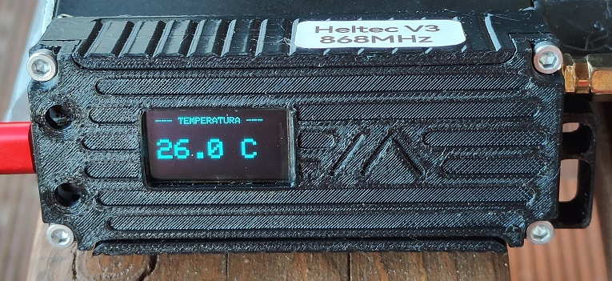

# 📡 RodosWX3 – Bresser Weather Sensor to APRS Gateway

**RodosWX3** to zaawansowane, wszechstronne oprogramowanie dla stacji pogodowych, integrujące zewnętrzne czujniki radiowe firmy Bresser (5-in-1, 6-in-1, 7-in-1) z amatorską siecią APRS. Projekt został stworzony z myślą o maksymalnej niezawodności, bezprzewodowej konfiguracji (Plug & Play) i wygodzie użytkowania.

Program jest multiplatformowy – automatycznie dostosowuje się do mikrokontrolerów z rodziny **ESP8266** oraz **ESP32** (w tym płytek zintegrowanych takich jak Heltec V2/V3, TTGO LoRa32, LilyGo).

---

## ✨ Główne Funkcje

*   **Asynchroniczny Panel WWW:** Przejrzysty dashboard odświeżany na żywo, działający w tle i nieblokujący nasłuchu radiowego.
*   **Bezprzewodowa Konfiguracja:** Wszystkie parametry (Sieć WiFi, APRS, Lokalizacja, Tryb pracy) zmieniasz przez przeglądarkę. Ustawienia zapisywane są w nieulotnej pamięci **LittleFS**.
*   **Dwa Tryby Transmisji APRS:**
    *   **APRS-IS:** Klasyczne połączenie TCP z ogólnoświatową siecią (np. `rotate.aprs2.net`).
    *   **KISS over TCP:** Wysyłanie ramek w standardzie AX.25 do lokalnych serwerów TNC (np. węzłów darmowej sieci iGate/Share-TNC).
*   **Filtrowanie ID Stacji:** Chroni przed przypadkowymi danymi od stacji sąsiadów. System słucha tylko przypisanego nadajnika.
*   **Sprzętowy Watchdog:** Automatyczny restart mikrokontrolera z wysłaniem komunikatu ratunkowego (ALARM) do sieci APRS, jeśli stacja zewnętrzna zamilknie na dłużej niż 5 minut.
*   **Zaawansowany Bufor Opadów:** Automatyczne przeliczanie sumy opadów z ostatniej godziny (`r`) i 24 godzin (`p`).
*   **Tryb Awaryjny (Access Point):** Przy braku zasięgu WiFi stacja stawia własną sieć `RodosWX3_Setup` do wstępnej konfiguracji.
*   **Karuzela OLED:** Obsługa ekranów SSD1306 (128x64). Automatyczne przełączanie co 4 sekundy między 4 ekranami (Status, Pogoda, Wiatr, Opady/Słońce).

---

## 🛠 Wymagania Sprzętowe

1.  **Mikrokontroler:** Dowolna płytka ESP8266 (np. Wemos D1 Mini) lub ESP32 (polecane zintegrowane płytki jak Heltec WiFi LoRa 32 V3 lub TTGO).
2.  **Odbiornik Radiowy:** Moduł 868 MHz – CC1101, SX1276 lub SX1262 (wspierane natywnie przez bibliotekę).
3.  **Czujnik Ciśnienia i Temperatury:** BME280 lub BMP280 (magistrala I2C).
4.  **Wyświetlacz:** OLED SSD1306 128x64 (często fabrycznie wbudowany w płytki deweloperskie).

---

## 🔌 Podłączenie i Okablowanie

### 1. Moduł Radiowy (LoRa / CC1101)
Jeśli używasz dedykowanej płytki ze zintegrowanym radiem (np. Heltec, TTGO), **nie musisz lutować dodatkowych przewodów ani zmieniać pinu w kodzie**. Wybierz swoją płytkę w środowisku Arduino IDE, a oprogramowanie samo zmapuje odpowiednie piny (SPI, CS, IRQ, RST). 
W przypadku zewnętrznego modułu CC1101 należy podłączyć go do sprzętowej magistrali SPI mikrokontrolera.

### 2. Czujnik BME280 / BMP280 (I2C)
Czujnik musi zostać uruchomiony w trybie **I2C**. Jeśli posiadasz moduł 6-pinowy, wykonaj następujące zmostkowania:

| Pin BME280 | Podłączenie ESP | Opis / Działanie |
| :--- | :--- | :--- |
| **VCC** | 3.3V | Zasilanie układu |
| **GND** | GND | Masa |
| **SCL / SCK** | Pin SCL | Zegar I2C |
| **SDA / SDI** | Pin SDA | Linia danych I2C |
| **CSB** | 3.3V (VCC) | Mostek z VCC – wymusza tryb I2C |
| **SDO** | GND | Mostek z masą – ustawia adres I2C na `0x76` |

*   *Wskazówka ESP8266:* Program domyślnie wykorzystuje pin **D1 (SCL)** oraz **D2 (SDA)**.
*   *Wskazówka ESP32:* Program automatycznie przypisze piny I2C zgodne ze schematem producenta Twojej płytki. Wystarczy podpiąć się w sprzętowe SCL/SDA.

---

## 💻 Instalacja i Biblioteki

Aby poprawnie skompilować kod w Arduino IDE, pobierz i zainstaluj z Menedżera Bibliotek:

*   `BresserWeatherSensorReceiver` (dekoder radiowy)
*   `Adafruit BME280 Library` oraz `Adafruit Unified Sensor` (obsługa BME/BMP280)
*   `Adafruit GFX` oraz `Adafruit SSD1306` (obsługa ekranów OLED)
*   `ESPAsyncWebServer` (asynchroniczny serwer WWW)
*   `AsyncTCP` (dla ESP32) lub `ESPAsyncTCP` (dla ESP8266)

Zanim wgrasz kod, upewnij się, że z menu *Narzędzia -> Płyta* wybrano poprawny wariant urządzenia.

---

## 🚀 Pierwsze Uruchomienie (Konfiguracja)

Ponieważ urządzenie zaraz po wgraniu softu nie zna Twojego hasła do WiFi, przejdzie w tryb konfiguracji (Access Point).

1.  Włącz zasilanie mikrokontrolera.
2.  Na telefonie lub komputerze znajdź sieć WiFi o nazwie **`RodosWX3_Setup`** i połącz się z nią.
3.  Uruchom przeglądarkę i wejdź pod adres: `http://192.168.4.1`
4.  W panelu WWW uzupełnij Główną Konfigurację Stacji (SSID i hasło routera, CallSign, tryb APRS, współrzędne geograficzne).
5.  Kliknij **Zapisz konfigurację i zrestartuj**. 
6.  Urządzenie uruchomi się ponownie, połączy z domową siecią, a przypisany mu adres IP zostanie wyświetlony na ekranie OLED.

---

## 🔒 Filtrowanie ID (Parowanie Stacji)

Stacje Bresser po włożeniu nowych baterii generują zawsze nowy, losowy numer ID. Aby stacja bazowa ignorowała zakłócenia i dane z sąsiedztwa:

1.  Zaloguj się do panelu WWW stacji bazowej.
2.  Włóż baterie do jednostki zewnętrznej na dachu.
3.  W panelu stacji rozwiń listę "Wykryte w okolicy". System wyświetli zebrane identyfikatory sprzętowe.
4.  Wybierz nowe ID i zapisz ustawienie. Od tego momentu sprzęt przypisany jest "na sztywno" i chroniony logiką wbudowanego watchdoga.

---
Stworzone przy użyciu AI dla krótkofalowców na podstawie https://github.com/matthias-bs/BresserWeatherSensorReceiver
